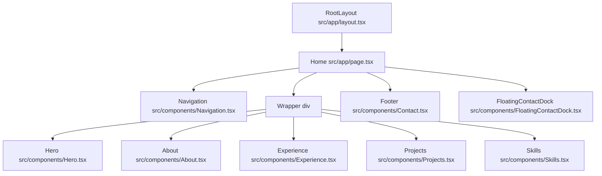

# 🏛️ Architecture & Design System Documentation

This document explains the technical details of the personal portfolio website, focusing on component structure, layout, custom styling systems (Tailwind CSS v4), and Framer Motion animations.

---

## 🌲 Component Hierarchy & Layout

The entry point of the layout is [layout.tsx](file:///Users/hudanugraha/Documents/antiGravity/personal-website/mhudanugraha.github.io/src/app/layout.tsx), which sets up the HTML framework, defines SEO metadata, loads the Google Inter font, sets the page to dark mode, and establishes a fixed background overlay.

The main page [page.tsx](file:///Users/hudanugraha/Documents/antiGravity/personal-website/mhudanugraha.github.io/src/app/page.tsx) renders components in a vertical stack:



### Component Roles & Details

1. **[Navigation](file:///Users/hudanugraha/Documents/antiGravity/personal-website/mhudanugraha.github.io/src/components/Navigation.tsx)**: Top sticky header. Uses React state to monitor scroll position and adds background blur + shadow once scrolled > 50px.
2. **[Hero](file:///Users/hudanugraha/Documents/antiGravity/personal-website/mhudanugraha.github.io/src/components/Hero.tsx)**: Landing section containing profile picture, intro texts, main CTAs (View Work, Contact Me), and quick social profile link shortcuts.
3. **[About](file:///Users/hudanugraha/Documents/antiGravity/personal-website/mhudanugraha.github.io/src/components/About.tsx)**: Modular description block inside a premium glass card, backed by colorful decorative blurred gradients.
4. **[Experience](file:///Users/hudanugraha/Documents/antiGravity/personal-website/mhudanugraha.github.io/src/components/Experience.tsx)**: Displays a timeline of career roles. Company names render as clickable link badges with company logos.
5. **[Projects](file:///Users/hudanugraha/Documents/antiGravity/personal-website/mhudanugraha.github.io/src/components/Projects.tsx)**: Displays a responsive grid of project cards with title character badges, project details, direct links to code/demos, and technology tag listings.
6. **[Skills](file:///Users/hudanugraha/Documents/antiGravity/personal-website/mhudanugraha.github.io/src/components/Skills.tsx)**: Shows categorized arrays of technical tools, programming languages, and QA testing methodologies inside modular glass panels.
7. **[Footer](file:///Users/hudanugraha/Documents/antiGravity/personal-website/mhudanugraha.github.io/src/components/Contact.tsx)**: Basic footer printing copyright owner dynamically with year utility.
8. **[FloatingContactDock](file:///Users/hudanugraha/Documents/antiGravity/personal-website/mhudanugraha.github.io/src/components/FloatingContactDock.tsx)**: Adaptive contact dock. On desktop devices, it renders as a fixed sidebar on the right with hover tooltips. On mobile, it displays as a floating pill-shaped tray at the bottom center.

---

## 🎨 Theme & CSS Styling System (Tailwind CSS v4)

The project leverages **Tailwind CSS v4**, which uses CSS variables directly for style tokens in [globals.css](file:///Users/hudanugraha/Documents/antiGravity/personal-website/mhudanugraha.github.io/src/app/globals.css).

### 1. Color Customization (HSL-based tokens)
Colors are defined using HSL (Hue, Saturation, Lightness) color values. This enables easily modifying color tones across the whole design system. 

```css
:root {
  --background: 220 10% 4%;            /* Deep carbon background */
  --foreground: 210 20% 98%;           /* Cool white text */
  --card: 220 15% 6%;                  /* Card panels slightly lighter than background */
  --muted-foreground: 220 10% 60%;     /* Slate gray secondary text */
  --border: 220 15% 12%;               /* Border separator line gray */
  --radius: 0.75rem;                   /* Standard rounded corners (12px) */
}
```

These tokens are imported inside `@theme` in Tailwind CSS v4:
```css
@theme {
  --color-background: hsl(var(--background));
  --color-foreground: hsl(var(--foreground));
  --color-card: hsl(var(--card));
  --color-border: hsl(var(--border));
  --radius-lg: var(--radius);
}
```

### 2. Glassmorphism UI (.glass class)
The glass card aesthetic is achieved via the custom `.glass` helper utility at the bottom of [globals.css](file:///Users/hudanugraha/Documents/antiGravity/personal-website/mhudanugraha.github.io/src/app/globals.css#L93-L98):
```css
.glass {
  background: rgba(15, 20, 25, 0.4);       /* Semi-transparent dark overlay */
  backdrop-filter: blur(12px);             /* Behind-layer blur */
  -webkit-backdrop-filter: blur(12px);     /* Safari fallback */
  border: 1px solid rgba(255, 255, 255, 0.05); /* Ultra-thin white border highlights */
}
```

### 3. Background Radial Lights
To give depth and space styling, a fixed dark radial gradient background is placed at [layout.tsx](file:///Users/hudanugraha/Documents/antiGravity/personal-website/mhudanugraha.github.io/src/app/layout.tsx#L25):
```tsx
<div className="fixed inset-0 -z-10 h-full w-full items-center px-5 py-24 [background:radial-gradient(125%_125%_at_50%_10%,#000_40%,#1e1b4b_100%)]"></div>
```
This overlays a subtle, deep indigo glowing eclipse centered at the top of the viewport.

---

## 🎬 Framer Motion Animations

Smooth, natural motion is built into page interactions.

### 1. Viewport Triggered Transitions (Scroll Reveals)
Sections and list elements fade in and slide up smoothly when they enter the viewport. This is controlled via Framer Motion's `whileInView` and `viewport` configurations:
```tsx
<motion.div
  initial={{ opacity: 0, y: 20 }}
  whileInView={{ opacity: 1, y: 0 }}
  viewport={{ once: true, margin: "-100px" }}
  transition={{ duration: 0.5 }}
>
  {/* Content */}
</motion.div>
```
- `once: true`: Ensures the animation only fires once (does not repeat when scrolling up/down).
- `margin: "-100px"`: Delay action until element is 100px inside the window edge for better visual timing.

### 2. Physics-Based Springs (Contact Dock)
The social contact buttons use spring physics for quick, bouncy hover transitions. Under [FloatingContactDock.tsx](file:///Users/hudanugraha/Documents/antiGravity/personal-website/mhudanugraha.github.io/src/components/FloatingContactDock.tsx#L33-L46):

```typescript
const buttonVariants = {
  initial: { scale: 1 },
  hover: { 
    scale: 1.08,
    borderColor: "rgba(255, 255, 255, 0.25)",
    backgroundColor: "rgba(255, 255, 255, 0.08)",
    boxShadow: "0 0 30px rgba(255, 255, 255, 0.08)"
  }
};

const iconVariants = {
  initial: { y: 0 },
  hover: { y: -3 } // Icon floats upward slightly
};
```

Using these configurations, when hovering on a contact card:
- The card scales up by 8% and brightens its border and shadow.
- The inner icon pops upwards with high spring stiffness (`stiffness: 300, damping: 20`) for a responsive tactile feel.
